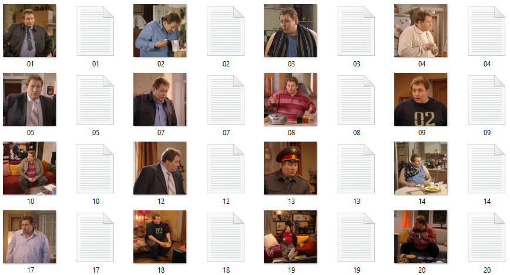

# lora-dataset-prep

**Turn a folder of raw photos into a clean, captioned, validated LoRA training dataset — in one command.**

[](https://www.python.org/)
[](LICENSE)
[](https://github.com/afloy011-spec/lora-dataset-prep/actions/workflows/test.yml)
[](SKILL.md)

[Quick start](#quick-start) · [How it works](#how-it-works) · [Captioning](#the-captioning-rule) · [Validation](#what-gets-validated) · [Agent skill](#use-as-an-agent-skill) · [Reference](reference.md)

<br>

Training a LoRA is easy. Preparing the dataset is where it goes wrong:
duplicate frames overfit a pose, an uncaptioned uniform becomes part of the
character, one repeated adjective makes every generation warm-lit. This tool
catches all of that **before** you spend GPU hours.

Built for **Ostris AI Toolkit / Z-Image Turbo**. Character LoRA first;
style, object, clothing, and environment supported.

```text
 raw_photos/                      my_dataset/
 ├── IMG_4032.jpg                 ├── train/
 ├── фото (3).png        ──►      │   ├── 01.png • 01.txt   caption sidecars
 ├── screenshot.webp              │   ├── 02.png • 02.txt
 └── ...                          │   └── ...
                                  ├── raw/                  originals, untouched
                                  ├── README.md             auto-generated dataset card
                                  └── metadata.json         full provenance
```

<br>

## Quick start

No dependencies needed for the core workflow — Python standard library only.

```bash
# 1 · Dry-run: prints the full plan, changes nothing
python prepare_dataset.py --source ./raw_photos --output ./my_dataset \
    --type character --trigger mychar01

# 2 · Apply
python prepare_dataset.py --source ./raw_photos --output ./my_dataset \
    --type character --trigger mychar01 --execute

# 3 · Hand-edit captions, then re-check (read-only)
python prepare_dataset.py --validate-only --output ./my_dataset
```

Prefer questions over flags? Just run `python prepare_dataset.py`.

<br>

## How it works

| Stage | What happens |
|:--|:--|
| **1 · Scan** | Finds `.jpg` / `.jpeg` / `.png` (WebP via `--convert-webp`; subfolders via `--recursive`), skips junk |
| **2 · Quality gate** | Flags small images, blur, EXIF-rotated phone photos, exact duplicates (SHA-256), near-duplicates (perceptual dHash) |
| **3 · Organize** | Sequential zero-padded names, originals backed up to `raw/` |
| **4 · Caption** | Writes a `.txt` sidecar per image — four modes, see below |
| **5 · Validate** | 20+ checks on the finished dataset |
| **6 · Document** | Dataset card (`README.md`) + machine-readable `metadata.json` |

Every run is a **dry-run by default**. Files change only with `--execute`.

### Caption modes

| Mode | Output | Best for |
|:--|:--|:--|
| `template` | Structured captions with `[BRACKET]` placeholders to fill in | Default starting point |
| `minimal` | `mychar01, portrait photo` stubs | Writing everything by hand |
| `vlm` | Real descriptions via **Claude Vision API** | Best quality, hands-off |
| `local` | Florence-2 or BLIP, fully offline | No API key available |

> `vlm` needs `pip install anthropic` + `ANTHROPIC_API_KEY`. Raw BLIP output
> violates the caption formula and must be rewritten — details in
> [reference.md](reference.md#local-captioning-blip--florence-2--read-before-using).

<br>

## The captioning rule

> **Describe what you do *not* want the LoRA to learn.**
> Everything left out of the caption gets bound to the trigger token.

So the face is never described — and clothing, pose, lighting, and background
always are, keeping them flexible at inference:

```diff
+ zvqmark, a still from a TV show, medium shot of a man wearing a dark police
+ uniform with a blue shirt and tie, standing in a kitchen with hands on hips,
+ looking down with a stern expression, warm interior lighting

- zvqmark, masterpiece, best quality, handsome man, detailed face, 8k
```

The full guide — formula, include/omit tables, per-type strategies, typical
mistakes — lives in [reference.md](reference.md).

<br>

## What gets validated

**Structure** — image↔caption pairing, orphans, duplicate basenames, unsafe filenames

**Captions** — trigger presence and position, length (15–35 word target),
unfilled `[BRACKET]` placeholders, filler phrases, multiple subjects,
failed-VLM markers

**Attribute sticking** — any content phrase repeated in ≥ 50 % of captions is
flagged; the silent killer that bakes one lighting or gaze into every generation

**Images** — minimum dimensions, blur heuristic (tunable via
`--blur-threshold`, `0` disables), EXIF rotation flags (phone photos that
would train sideways — `--resize` bakes the rotation into the pixels),
exact and near-duplicate detection

<br>

## Use as an Agent Skill

Drop the folder into your skills directory — the agent picks it up whenever you
ask it to prepare a dataset, write captions, or choose a trigger word:

| Agent | Path |
|:--|:--|
| Claude Code | `~/.claude/skills/lora-dataset-prep/` |
| Cursor | `~/.cursor/skills/lora-dataset-prep/` |

The agent reads [SKILL.md](SKILL.md) for the workflow and
[reference.md](reference.md) for captioning rules, then drives the CLI for you.

<br>

## Options

| Flag | Purpose |
|:--|:--|
| `--type` | `character` · `style` · `object` · `clothing` · `environment` |
| `--captions` | `template` · `minimal` · `vlm` · `local` |
| `--resize 1024` | Shortest side to 1024 px; aspect preserved; never upscales; bakes EXIF rotation into pixels |
| `--recursive` | Include subfolders when scanning the source (hidden folders skipped) |
| `--repeats 10` | kohya-style `10_trigger/` folder naming |
| `--convert-webp` | WebP → PNG (many trainers can't read WebP) |
| `--blur-threshold 50` | Blur sensitivity; `0` disables |
| `--validate-only` | Read-only check of an existing dataset |
| `--execute` | Apply changes — without it, always a dry-run |

Complete table: [SKILL.md → Options Reference](SKILL.md#options-reference).

<br>

## Development

```bash
pip install pytest Pillow
python -m pytest test_prepare_dataset.py -q        # 79 tests, ~3 s
```

The suite covers caption generation, hashing, perceptual dedupe, resize,
EXIF-orientation handling, every validation rule, attribute-sticking
detection, and the VLM path (mocked API — no key needed). CI runs the same
suite on Python 3.9–3.12 for every push; releases are tagged and summarised
in [CHANGELOG.md](CHANGELOG.md).

```text
lora-dataset-prep/
├── SKILL.md                   agent entry point + full options table
├── reference.md               captioning & dataset guide
├── prepare_dataset.py         the tool — stdlib-only core
├── test_prepare_dataset.py    test suite
└── LICENSE                    MIT
```

<br>

---

**[MIT](LICENSE)** © [afloy011-spec](https://github.com/afloy011-spec)

*If this saved you a failed training run, a star is appreciated.*
